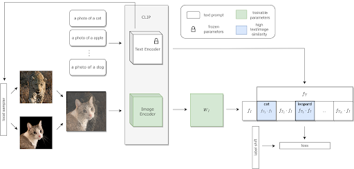

# Text Supervised LFM

This contains the implementation for local feature mixup as well as the training procedure.

## LFM

- Local Sampling is defined as a PyTorch Sampler called LocalClassSampler, which is located in `data/dataloader.py`.
- All Label shift and other mixup procedures are defined inside `mixups.py`.
