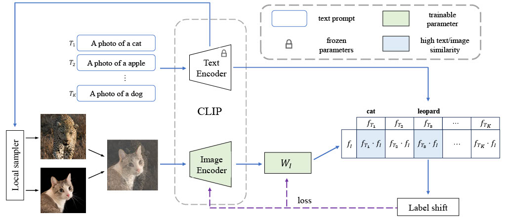

<div align="center">
<h1>Text-Guided Mixup Towards Long-Tailed Image Categorization</h1>

<p>
  BMVC 2024

  [Richard Franklin](https://rsamf.github.io/),
  [Jiawei Yao](https://alexander-yao.github.io/),
  [Deyang](),
  [Qi Qian](https://scholar.google.com/citations?user=Rp_40_gAAAAJ&hl=en&oi=ao),
  [Juhua Hu](http://faculty.washington.edu/juhuah/)*
</p>

  |  | 
  |:--:| 
  | *Model architecture with LFM used to extend the decision boundary of minor classes towards nearby classes* |

</div>

## Requirements
 - We recommend Linux for performance and compatibility reasons.
 - 1 NVIDIA GPUs. We developed and trained the model using RTX 2080 Ti (11GB).
 - Python dependencies are located in `requirements.txt`

## Getting started
### Datasets
- [x] CIFAR100
- [x] CIFAR10
- [x] Places365
- [x] Imagenet 2012


### Training and evaluation
CIFAR100 dataset
```
python main.py --cfg config/general.yaml config/proposed/lfm-mms.yaml --gpu 0
```

CIFAR10 dataset
```
python main.py --cfg config/general.yaml config/cifar10.yaml config/proposed/lfm-mms.yaml --gpu 0
```

Places365 dataset
```
python main.py --cfg config/general.yaml config/places.yaml config/proposed/lfm-mms.yaml
```

Imagenet dataset
```
python main.py --cfg config/general.yaml config/imagenet.yaml config/proposed/lfm-mms.yaml
```


<!-- ## Bibtex
Please cite our paper if you use this code in your own work:
```
``` -->

## Acknowledgement
This research is supported in part by Advata Gift and National Science Foundation funding. All opinions, findings, conclusions and recommendations in this paper are those of the author and do not necessarily reflect the views of the funding agencies.
